# CGReplay: Capture and Replay of Cloud Gaming Traffic for QoE/QoS Assessment
**Note:** This paper was accepted as a Demo in the IEEE Netsoft 2025 conference.

[](https://netsoft2025.ieee-netsoft.org/)
[](CGReplay_Demo.pdf)
[](https://docs.google.com/presentation/d/1Kf5hDO_R_EbwMqTEkOlxQvo_gMdOgFPpOrphWt-vvn8/edit?usp=sharing)


Cloud Gaming (CG) research faces challenges due to the unpredictability of game engines and restricted access to commercial platforms and their logs.

This creates major obstacles to conducting fair experimentation and evaluation.

_CGReplay_ captures and replays the player/gamer commands and the corresponding video frames in an ordered and synchronized action-reaction loop, ensuring reproducibility and fairness.

It enables Quality of Experience/Service (QoE/QoS) assessment under varying network conditions and serves as a foundation for broader CG research.

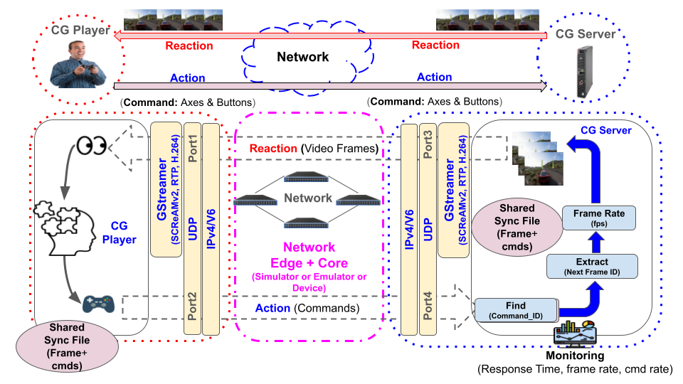

___

## Datasets
We have provided a [link](https://www.kaggle.com/datasets/alirezashz/cloud-gaming-captured-screen-dataset) to several different cloud gaming session datasets. Specifically, these are PCAPs recorded from Xbox Cloud Gaming for Forza Horizon 5, Mortal Kombat 11, and Fortnite (so far).


---

## Pre-built VM
To facilitate the demonstration, a [pre-built VM](https://drive.google.com/file/d/1V20co3MwUHLLgKiwa8DJJV9DDRg3wTJC/view) with Ubuntu 24.04 and Python 3.12.3 was configured, from where the dependencies ([requirements.txt](https://github.com/dcomp-leris/CGReplay/blob/main/requirements.txt)) were extracted.

---

## Build from Source
If you prefer to build everything from source, please follow the steps below

### Requirements
* [Python 3.12.3 (or higher)](https://www.python.org/downloads/)
* [GStreamer](https://gstreamer.freedesktop.org/download/#linux)
* pip (24.0 or higher)
* ffmpeg - 4.4.2 or higher (sudo apt install -y ffmpeg)
* tshark - 3.6.2 or higher (sudo apt install -y tshark)


### Repository Structure

```
├── capturing
│   ├── capturing
│   │   ├── config.yaml
│   │   ├── joystick_log.txt
│   │   ├── modules
│   │   │   ├── capture_joystick.py
│   │   │   └── capture_screen.py
│   │   └── run_capturing.py
│   ├── install.txt
│   └── synching
│       ├── config.yaml
│       ├── frame_log.txt
│       ├── mix.txt
│       ├── modules
│       │   ├── mixing.py
│       │   ├── ordering.py
│       │   └── read_frames.py
│       ├── sync.py
│       └── sync.txt
├── config
│   └── config.yaml
├── imgs
│   ├── cgplayer_run_session.png
│   ├── cgreplay_arch.png
│   ├── check_main_mininet_terminal.png
│   ├── connect_objects.png
│   ├── create_hosts.png
│   ├── create_switch.png
│   ├── open_miniedit.png
│   ├── open_xterms.png
│   ├── pre_create_hosts.png
│   ├── pre_open_xterms.png
│   ├── pre_rename_hosts.png
│   ├── rename_player.png
│   ├── rename_server.png
│   ├── run_topology.png
│   └── showcase_kombat.png
├── player
│   ├── cg_gamer1.py
│   ├── run_multi_cg_gamer.py
│   └── syncs
│       ├── sync_fortnite.txt
│       ├── sync_forza.txt
│       └── sync_kombat.txt
├── port_clean.sh
├── README.md
├── requirements.txt
└── server
    ├── cg_server1.py
    └── syncs
        ├── sync_fortnite.txt
        ├── sync_forza.txt
        └── sync_kombat.txt
```

___

## Introduction
CGReplay records the gamer's and CG Server's behavior in each cloud gaming (CG) platform (e.g., GeForce NOW, XCloud) and replays the CG and gamer behavior to generate the traffic. So, it has two general phases: *(a) Capturing* and *(b) Replaying*. 

**(a) Capturing**: Capture and record system commands along with video frames, ensuring proper synchronization between the sequence of commands and the corresponding video frames.

**(b) Replaying**: Replay the captured video frames from the CG server while simultaneously executing the corresponding commands from the gamer in the correct order.

---

## Setup

Here’s a step-by-step guide to setting up a Python virtual environment (venv) for Python 3.12.3 or later:

### **Step 1: Joystick Configuration**

Make sure you have a joystick that can be connected via USB. Otherwise, you will only be able to collect frames without the commands (buttons, axes).

#### If you have a joystick:
```bash
sudo apt install joystick
```

#### If you don't have a joystick:
Go to the file `capturing/capturing/config.yaml` and `set  enable_joystick: False` to disable the Joystick capturing. 

> NOTE: If you do not have a joystick, you can only capture video frames!


### **Step 2: Ensure Python 3.12.3 is Installed**

Run the following command to check if Python 3.12.3 is installed:

```bash
python3 --version
```
or
```bash
python --version
```

If you don’t have Python 3.12.3, download and install it from the official website:
[https://www.python.org/downloads/](https://www.python.org/downloads/)

> NOTE: Make sure python or python3 is the alias for Python 3.12.3 with `python --version` or `python3 --version`.

### **Step 3: Create a Virtual Environment at /home/\<username\>**
Run the following command to create a virtual environment named `venv`:

```bash
cd
```

```bash
python3 -m venv CGReplay_venv
```
> NOTE: Maybe your alias is different. For instance `python3.12` instead of `python3`

```bash
cd
```

```bash
python -m venv CGReplay_venv
```

This will create a folder named `CGReplay_venv` in your _/home/\<username\>_ containing the necessary files for the virtual environment.

### **Step 4: Activate the Virtual Environment**
#### **On macOS/Linux:**
```bash
source venv/bin/activate
```

Once activated, you should see `(CGReplay_venv)` in your terminal prompt, indicating that the virtual environment is active.

### **Step 5: Clone the project**
Open a terminal and navigate to the directory where you want to create your virtual environment:

```bash
cd /path/to/the/folder/you/cloned/CGReplay
```

and clone it:

```bash
git clone https://github.com/dcomp-leris/CGReplay.git
```

### **Step 6: Download the logs and frames**
You have access to all collected frames and command logs [HERE](https://www.kaggle.com/datasets/alirezashz/cloud-gaming-captured-screen-dataset) for testing on different games: Forza Horizon 5, Mortal Kombat 11, and Fornite.

### (Optional) **Upgrade `pip`**
After activating the virtual environment, upgrade `pip` to the latest version:

```bash
pip install --upgrade pip
```

### **Step 7: Install Python requirements/dependencies**
Now you can install your project's dependencies using `pip`.

If you have a `requirements.txt` file, install all dependencies with:

```bash
pip install -r requirements.txt
```

### Install GStreamer
Let us build OpenCV with GStreamer support. First, make sure you have some tools/libraries before continue:

#### Remove any `opencv-python` (a.k.a., cv2) - if any:

```
pip uninstall opencv-python --break-system-packages
```

and 

```
sudo pip uninstall opencv-python --break-system-packages
```

#### Install GStreamer:
```
gst-inspect-1.0 avdec_h264
```


#### Install dependencies:
```
sudo apt update && sudo apt install -y \
  build-essential cmake git pkg-config \
  libgtk-3-dev libcanberra-gtk* \
  libgstreamer1.0-dev libgstreamer-plugins-base1.0-dev \
  libjpeg-dev libpng-dev libtiff-dev \
  libavcodec-dev libavformat-dev libswscale-dev \
  libv4l-dev libxvidcore-dev libx264-dev \
  python3-dev python3-numpy \
  libgirepository1.0-dev gir1.2-gtk-3.0
```


#### Install GStreamer codecs (especially H.264):
```
sudo apt update
sudo apt install \
    gstreamer1.0-plugins-base \
    gstreamer1.0-plugins-good \
    gstreamer1.0-plugins-bad \
    gstreamer1.0-plugins-ugly \
    gstreamer1.0-libav
```

#### Check if H.264 is available:
```
gst-inspect-1.0 avdec_h264
```

#### Test GStreamer with a dummy stream session code:
```
gst-launch-1.0 udpsrc port=5002 ! application/x-rtp, payload=96 ! queue max-size-time=1000000000 ! rtph264depay ! avdec_h264 ! videoconvert ! autovideosink
```

___

## (a) Capture phase


### **Step 8: Generate a recording**
We need to generate a video file (e.g., mp4) before replaying it (of course).

To do that, go to `CGReplay/capturing/capturing` and run `run_capturing.py

```python
python3 run_capturing.py
```

This command will run for 5 min (300 seg) to generate a file named `capture.mp4`. 

> NOTE: We can interrupt the screen recording anytime. The faster you do it, the less frames are capture.

### **Step 9: Genenerate frames/commands**
After generating the `capture.mp4` file, we need to generate the frames (png images, in this case).

```bash
sudo ffmpeg -i ./capture.mp4 -vf "fps=10" ./captured_frames/frm_%04d.png
```

The command above creates a number of images corresponding to a 10 FPS video. You can increase the `fps` variable, but this will increasing the number of images considerably.

The generated frames are stored in `CGReplay/capturing/capturing/captured_frames` folder.


### Step 10: Sync frames/commands

At this point, we already have the frames and commands logs. However, we still need to sync them:


Go to `CGReplay/capturing/synching` and:

1. Create the output folder - if not already exists:

```
mkdir -p output
```

2. Create a log folder inside server folder:

```
mkdir -p logs
```

2. Then, run the script that synchronizes commands and frames:
```python
sudo python3 sync.py
```


After the syncronization is done, we can see the ordered frames in `CGReplay/capturing/synching/output/frames`, the log of how this ordering happened on `CGReplay/capturing/synching/output/frames_log.txt` and `CGReplay/capturing/synching/output/mix.txt` These logs were generated and used to create the `sync.txt` which will be used for synchronization in both *CG server* and *CG Gamer*!

___

## (b) Replay phase
In this section, we explore how to replay the capture frames and joystick commands.

CGReplay allows to run on real networks. For instance, we could run the experiment on Tofino switches. However, for this tutorial we will install Mininet to allow the user to run everything on a single computer.


### Mininet experiment

### **Step 1: Install Mininet**

Before we start to replay the captured frames, we must make sure Mininet is installed. You can follow the guidelines [here](https://mininet.org/download/). We recommend you install from source (Option 2) or from package (Option 3).

> Note: We are not going to install it from the repository, but only use MiniEdit from it. This is because the installation from source requires `pep8` which is not longer available. Even manually replacing pep8 by `pycodestyle` did not fix it.

#### Install Tkinter
Make sure you have `tkinter` to open MiniEdit:
```sudo apt install python3-tk```

#### Install zbar library
You also need `zbar` library:

```
sudo apt install libzbar0
```

#### Install Xterm
If, for some reason, Mininet installation from apt does not include Xterm, you can install it manually:

```
sudo apt install xterm
```

### Step 2: Create a Mininet topology
As we are using Mininet, we can create a simple Mininet topology using MiniEdit that should look like this: `H1 <-> S1 <-> H2`, where `H1` is the server, `S1` is the switch in the middle, and `H2` is the client (gamer). To do that, follow the steps below: 


#### A. Open MiniEdit
```bash=
sudo python3 ./mininet/examples/miniedit.py
```

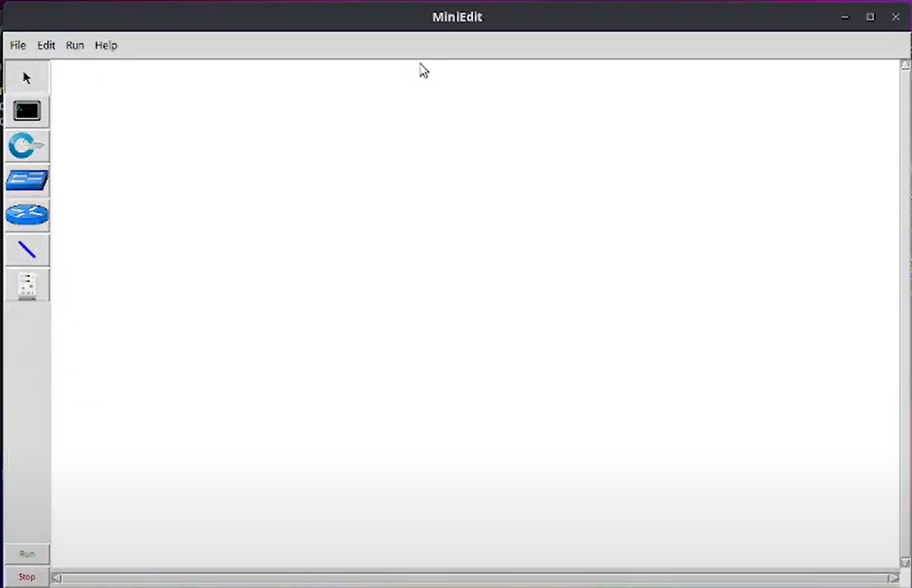


#### B. Create a switch object

Go to the left panel and select the `LegacySwitch` object. Then, click anywhere in the MiniEdit workspace (e.g., middle) to create the object (as shown below):

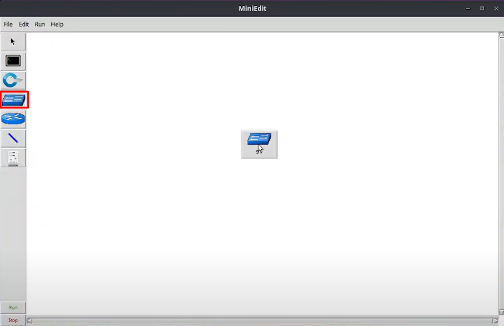


#### C. Create the hosts
We want the simplest topology we can get. So, let's create two hosts. Similarly to the previous step, go to the left and select the host icon:

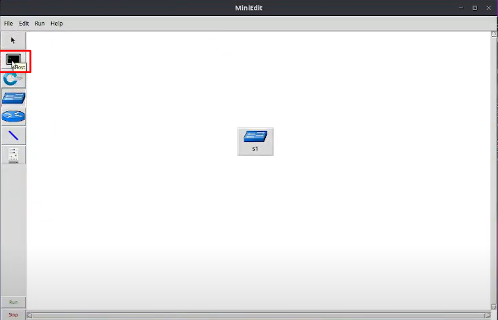


Then, create the objects close to the switch `S1`:

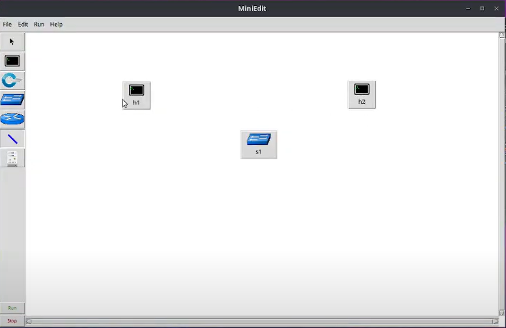

#### D. Connect the hosts and switch
After creating the hosts and the switch, we still need to connect those objects. To do that, select the 'blue line' icon and drag from `H1` to `S1` and from `S1` to `H2`, as the red arrows illustrated below. 

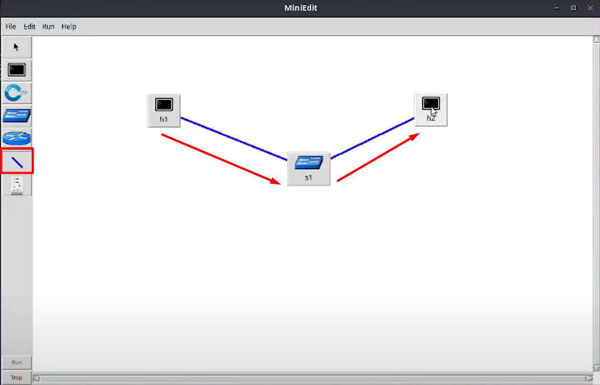


#### E. Rename hosts

Rename the hosts and keep the default network Mininet provides.

To do that, right click on `H1` object

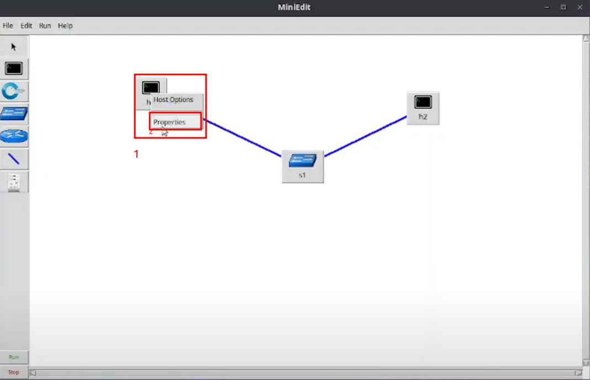


Then, at the _Hostname_ field, rename `h1` -> `cgserver` 


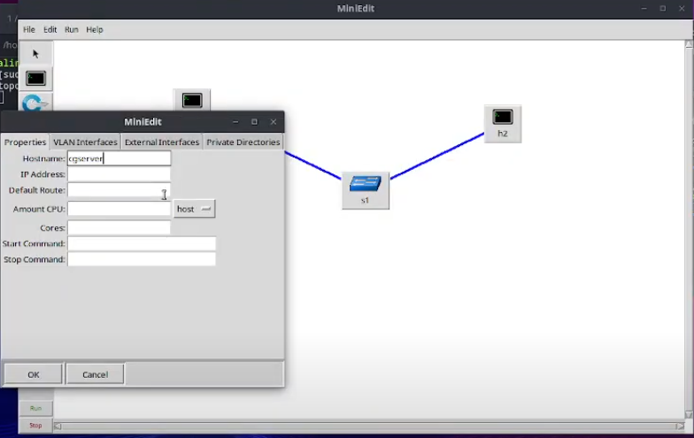

Finally, repeat the process for `h2` and rename it: `h2` -> `cgplayer`


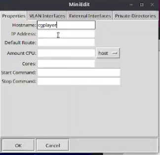


### Step 3: Run the Mininet topology

After creating the objects on MiniEdit, press run (left bottom), as shown:

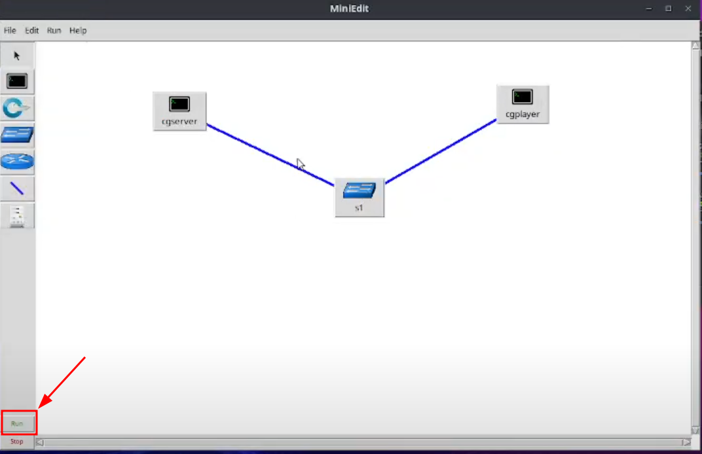


At this moment, you should see the terminal where we called MiniEdit initializing the Mininet topology:

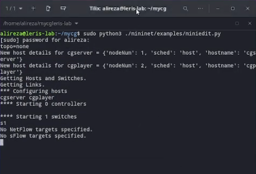


### Step 3: Understanding CGReplay default configuration 

Now, go to [**config.yaml**](https://github.com/dcomp-leris/CGReplay/blob/main/config/config.yaml) (`CGReplay->config->[config.yaml]`), where the main _server_ and _player_ configured is customized.

In `config.yaml` file, we find the default configuration to make CGReplay work:

```bash=
# CGReplay Configuration File
# -------------------------------------------------------------------------#

# CG server configuration
server:
    server_IP: "10.0.0.1"                # Server computer IP address
    server_port: 5000                    # UDP Port for receiving control (Joystick) commands from player
    server_command_port: 5001            # not used yet!
    server_interface: "cgserver-eth0"      # Not Mandatory!
    ##CGServerLog
    log_rate_control: "./logs/srv_ratectl.txt"
    log_server: "./logs/srv_total.txt"
    log_frame: "./logs/srv_frame.txt"
# -------------------------------------------------------------------------#

# CG  player configuration
gamer:
    player_IP: "10.0.0.2"                 # CG Gamer (or player) IP address
    player_streaming_port: 5002           # UDP port for streaming (receiving) the frames of the video games!
    palyer_command_port: 5003             # UDP Port for is binded in the server and used to send the command in the gamer system!
    player_interface:  "cgplayer-eth0"      # Gamer interface name!
    ## CG Player Log CGReplay/player/logs (rate/time logs + video frames in png)
    player_rate_log: "./logs/ratelog_CG.txt"
    player_time_log: "./logs/timelog_CG.txt"
    received_frames: "./logs/received_frames"
# -------------------------------------------------------------------------#

# Game Data Setup 
Forza:  # possible values: Fortnite  or  Kombat
    name: "Forza"
    sync_file: "./syncs/sync_forza.txt"
    frames: "./Forza"

Fortnite: 
    name: "Fortnite"
    sync_file: "./syncs/sync_fortnite.txt"
    frames: "./Fortnite"

Kombat: 
    name: "Kombat"
    sync_file: "./syncs/sync_kombat.txt"
    frames: "./Kombat"
# -------------------------------------------------------------------------#

# Encoding setup 
encoding:
    name: "H.264" # Default 
    fps: 30  # Frames per second
    resolution:
        width: 600 # default 1364
        height: 400 # default 768
    starting_bitrate: 5000
    bitrate_min: 4000
    bitrate_max: 10000
# -------------------------------------------------------------------------#
# Synchronization Sliding Window
sync: 
    window_min: 1 
    window_max: 4
    ack_freq: 30 # Send Ack after receiving 30 frames!
    ## Automatically increase and decrease the encoding rate
    ## (in CG server) based on frame quality and retransmission!
    jump: 0.2
    rise: 0.1
    decrese: 0.2
    fall: 0.2

# -------------------------------------------------------------------------#
# CGReplay Running Setup
Running:
    game: "Kombat"     # Set it to start the CGReplay specific Game
    live_watching: True    # If you want to watch live gameplay set 'True'
                           # else set 'False'
    duration: 300   # in seconds
    stop_frm_number: 100

# ------------------------------------------------------------------------#
# ScreAM Setup
protocols:
    SCReAM: False # False = 0 / True = 1
    sender: "../scream/scream/gstscream/scripts/sender.sh"
    receiver: "../scream/scream/gstscream/scripts/receiver.sh"

```


Lines 5-25 cover the CG _server_ and _gamer_ configuration. As we do not change the IPs, we always assume `H1` is named as `cgserver` (10.0.0.1) while `H2` is `cgplayer` (10.0.0.2). With those names, the `eth0` interface of the components will be named as `cgserver-eth0` and `cgplayer-eth0`, respectively. For each component (server and gamer) we have different logs. For both components we also have default ports and logs. On the server side, we set the UDP port as 5000 to receive the commands from the user. Similarly, on the gamer side, we receive the incoming frames from the server on port 5002 and send the commands to server through UDP 5003.

> NOTE: Port 5001 is not used yet, but we intend to leverage it in the future.

As mentioned, each component generate different logs after we run the experiment.

**Server logs**

`rate_control_log.txt` --> (Frame_ID, rate_ctl) [It shows Frame_ID and its sync status: High sync, Sync, Critical Sync, and Non-sync with each state encoding rate actions which can be jump, rise, decrease and fall]

`server_log.txt` --> {frame_id},{received_fame_id},{my_gap},{received_time},{send_time} {current_srv_fps},{received_fps},{current_cps},{received_cps} {current_srv_fps/received_fps},{received_cps/current_cps},{bitrate}

`frame_log` --> (f"{frame_id},{current_srv_fps},{processing_time},{bitrate}

> NOTE: processing time is the time wasted in the server. Bitrate in all logs refers to the frame rate and cps refers to command per second


**Gamer logs**

`rate_log` --> {frame_id},{current_fps},{currrent_cps}\
`time_log` --> {frame_id},{frm_rcv},{cmd_sent}\
`received_frames` --> it refers all frames received in the gamer side!

> NOTE: cmd is command, frm is frame, and rcv is received.


Lines 29-42 encompasses the game setup. For now, we can choose between 3 games: Forza Horizon 5, Mortal Kombat 11 or Fortnite. For each of the games, we have a `sync_file`. This file tries to order frames arriving out-of-order (of course), synchronizing them with their respective commands.

Lines 46-54 are the encoding settings. We first set a target `fps`. For instance, 30. Also, we have the game screen resolution as 600x400, which is downscaled, because the default is 1364x768. For now, H.264 is the only option available for encoding algorithm.

> NOTE: The target FPS is achieved (or not) depending on the hardware running the experiment.

Finally, lines 57-66 allows us to tweak synchronization and sliding window configuration. For instance, `ack_freq` determines after how many packets, we should receive an ACK. The variable `game` is where we select which of the game profiles/replays we want to run (e.g., `game: "Kombat"`).

> NOTE: if you want to enable SCREAM protocol or not by setting the variable `SCReAM` as _True_ or _False_.


### Step 4: Run the experiment


**On MiniEdit and Xterm** 
After the configuration file is set, we can run the experiment. To do it, open two xterm terminals: one for `cgserver` and another for `cgplayer`. To do this, right-click on the objects and open a terminal for each of them:

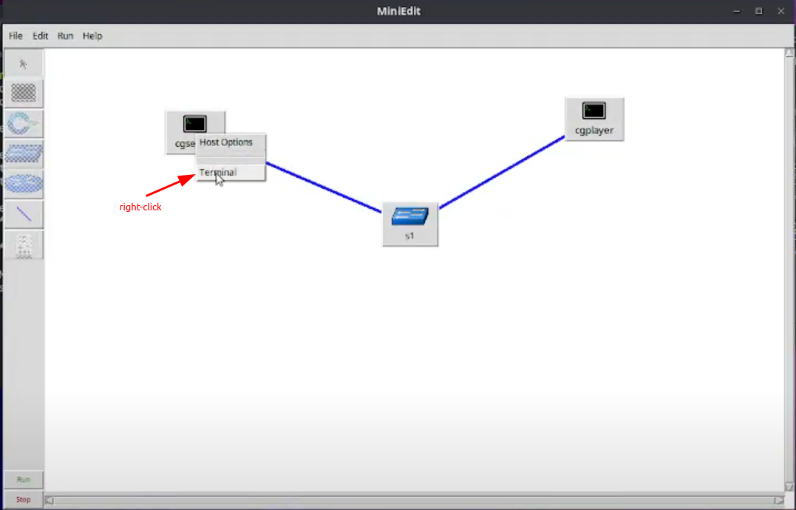

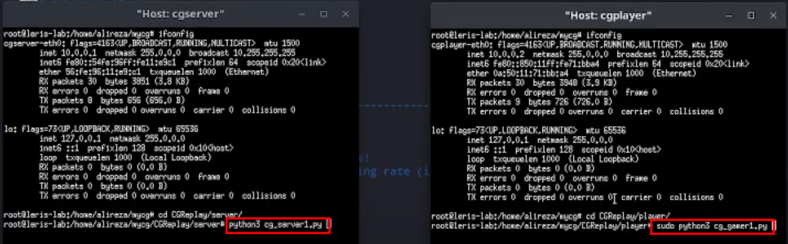


**Host-side (cgplayer terminal)**

Then, on the host-side, go to `CGReplay/player` on _cgplayer_'s terminal (right - image below) and run:

```python
python3 cg_gamer1.py
```

At this moment, the player/gamer will be ready to receive data on ports UDP:5002 and UDP:5003, (image below)

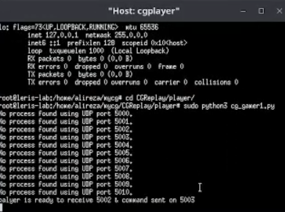

> NOTE: the cgplayer's script should always be run first!

**Server-side (cgserver terminal)**

Go to `CGReplay/server/` and run the script below on server-side (_cgserver_'s terminal):

```python
python3 cg_server_1.py
```

Immediately after we run the script on the server, a screen will show up and start replaying the frame. Meanwhile, we can see both the server and player's terminal exchanging frames and commands with the server.

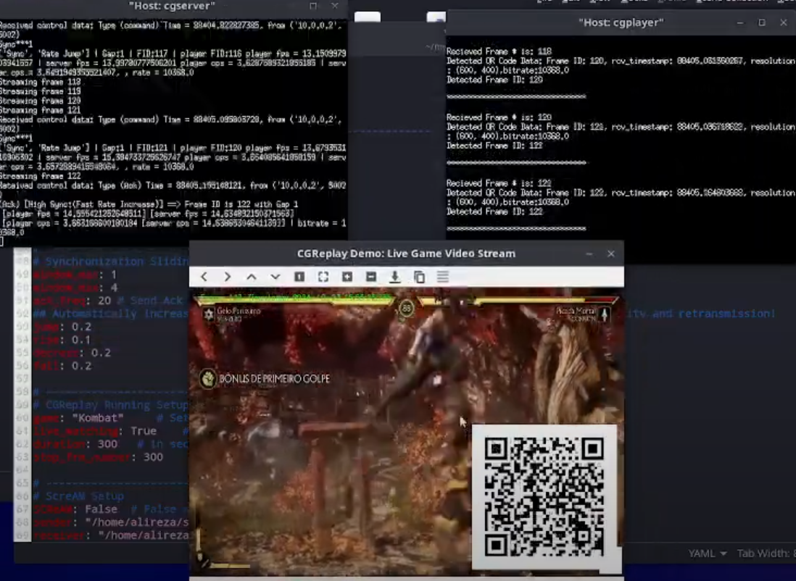

The experiment stops after 300 frames, because the default configuration sets the variable `stop_frm_number` is `300`. However, you can choose whatever frame numbers you want -- assuming, it is less or equal than the total number of frames for recorded game session.

> NOTE: Only 15 frames from Mortal Kombat 11 are available in the `server/Kombat` path due to GitHub's size limitations. The remaining frames can be downloaded from this link and added to each game's folder. For the expected folder names, check the "Game Data Setup" section in the `config/config.yaml` file.

After we run the experiment, we can have access to the logs discussed earlier on both the server- (`CGReplay/server/logs/`) and player-side (`CGReplay/player/logs/`). Also, the received frames at the user (player) will be availabled in `CGReplay/player/logs/received_frames`.


## Demo Technical Requirements

• Single laptop with Ubuntu Linux OS\
• Monitor with HDMI support\
• Power & Internet Access\
• Setup Time is around 30 min\
• The space provided by Netsoft'25
